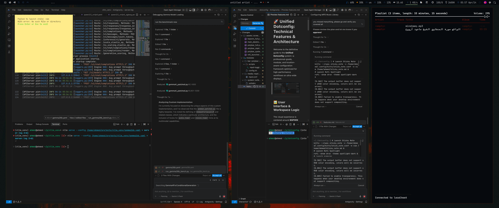
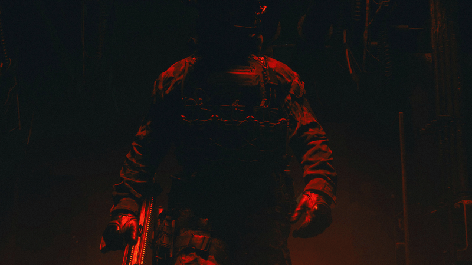
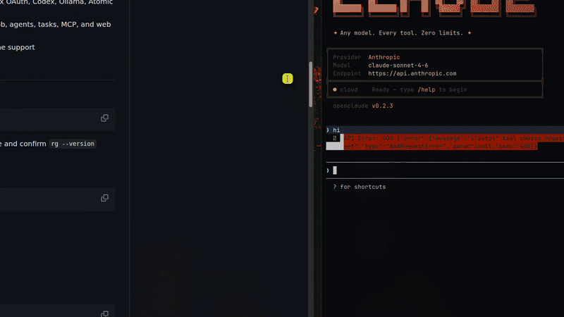
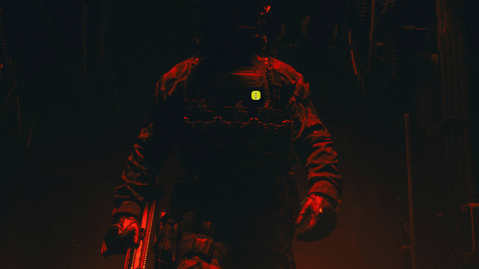
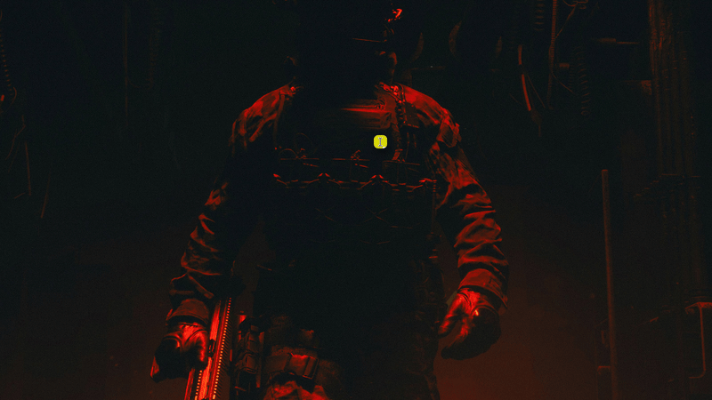
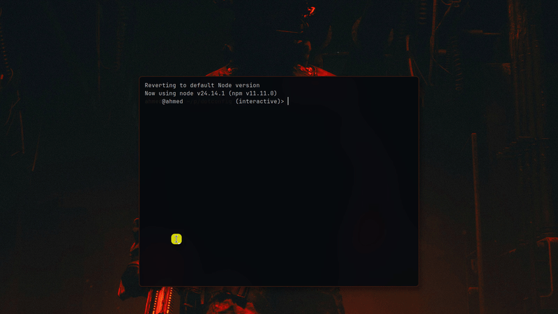
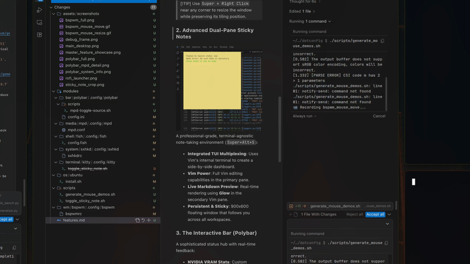
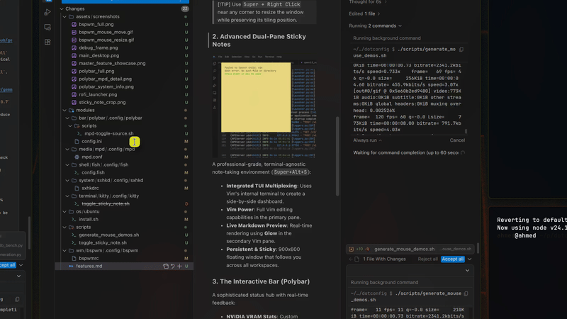
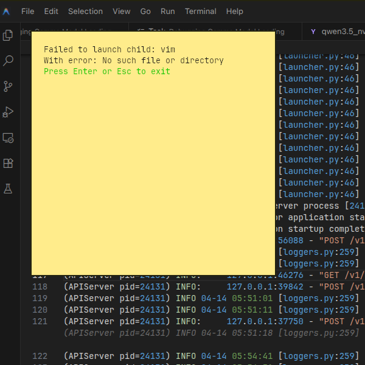
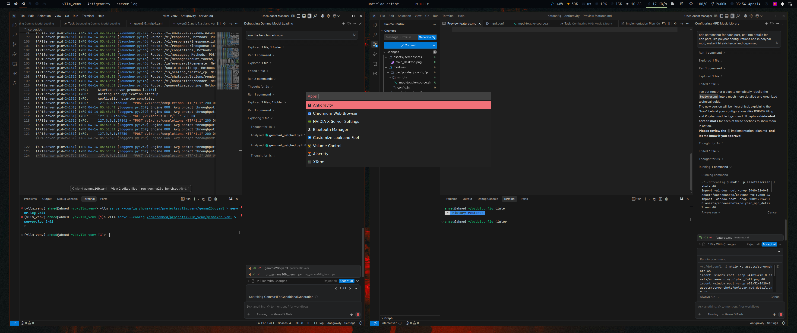

# 🚀 Unified Dotconfig: Master Features & Architecture Guide

Welcome to the definitive manual for the **Unified Dotconfig** repository—a professional-grade, high-performance orchestration system for Linux. This document covers every major service, core script, and "hidden" capability within the framework.

---

## 🏛️ Architectural Philosophy

This system is built as a **Managed Layered Orchestrator**, providing maximum portability without sacrificing per-machine customization.

### 1. The 6-Layer Priority Stack
Configurations are applied in a deterministic sequence, represented by the Master `Makefile`:
1.  **Base**: Global system defaults (Git, generic shell aliases).
2.  **OS**: Distribution-specific provisioning (Arch vs. Ubuntu/Debian).
3.  **WM**: Window Manager specific logic.
4.  **Modules**: Self-contained component configurations.
5.  **Hosts**: Hardware-specific overrides (e.g., monitor DP/HDMI names).
6.  **Overrides**: User-level final priority settings.

### 2. The Abstraction Layer
The system maps generic command aliases to your chosen applications:
- `terminal` → (Linked to Alacritty or Kitty)
- `browser` → (Linked to Qutebrowser or Firefox)
- `files` → (Linked to Thunar or PCManFM)
- `editor` → (Linked to Neovim, Vim, or Nano)

### 3. Progressive Symlinking
Our `symlink.sh` engine recursively mirrors directory structures while preserving the ability to overwrite links in later layers, ensuring your `$HOME` stays clean but highly customized.

---

## 🖼️ Visual Ecosystem & Workflow

Optimized for **3440x1440px** ultra-wide displays with a focus on ergonomics and aesthetics.

### 1. BSPWM (Tiling Logic)
The system uses **BSPWM**, a binary space partitioning window manager that represents windows as the leaves of a full binary tree.

#### ⌨️ Core Tiling Workflows
| Feature | Keybinding | Demonstration |
| :--- | :--- | :--- |
| **Automatic Tiling** | `Super + Return` |  |
| **Node Navigation** | `Super + {h,j,k,l}` |  |
| **Node Swapping** | `Super + Shift + {h,j,k,l}` |  |
| **Pre-selection** | `Super + Ctrl + {h,j,k,l}` |  |
| **Window States** | `Super + {f,s,t}` |  |
| **Interactive Resize** | `Super + Alt + Arrows` |  |

#### 🖱️ Mouse-Driven Tiling Management
Beyond hotkeys, the system supports intuitive mouse interactions for fluid desktop management:

| Feature | Interaction | Demonstration |
| :--- | :--- | :--- |
| **Move Window** | `Super + Button 1` |  |
| **Resize Side/Corner** | `Super + Button 2/3` |  |

> [!TIP]
> Use `Super + Right Click` near any corner to resize the window while preserving its tiling position.

- **Workspaces**: 6 semantic slots (󰌢 Terminal, 󰈹 Web, 󰨞 Code, 󰈙 Docs, 󰓇 Media, 󰊴 Game).
- **Geometry**: Optimized with `20px` gaps and `split_ratio: 0.53` for the perfect ultra-wide balance.
- **Rules**: Persistent window placement (e.g., Browsers always open on Workspace 2).

### 2. Advanced Dual-Pane Sticky Notes

A professional-grade, terminal-agnostic note-taking environment (`Super+Alt+S`):
- **Integrated TUI Multiplexing**: Uses Vim's internal terminal to create a side-by-side dashboard.
- **Vim Power**: Full Vim editing capabilities in the primary pane.
- **Live Markdown Preview**: Real-time rendering using **Glow** in the secondary Vim pane.
- **Persistent & Sticky**: 900x600 floating window that follows you across all workspaces.

### 3. The Interactive Bar (Polybar)
A sophisticated status hub with real-time feedback:
- **NVIDIA VRAM Stats**: Custom `custom/ipc` module tracking GPU memory—essential for VLLM/Inference status.
- **Smart Media Control**: Right-Click anywhere on the bar to toggle between local MPD music and global radio streams (with desktop notifications).
- **Redshift & Picom**: Integrated toggles for display temperature and compositor state.

---

## 🎵 Media & High-Fidelity Audio

The system includes a production-grade media stack designed for audiophiles and power users.

### 🎥 High-End MPV Configuration
- **AI Upscaling**: Integrated CNN-based shaders for real-time video enhancement:
    - **Anime4K**: specialized restoration and upscaling for animation.
    - **FSRCNNX**: High-performance upscaling for live-action content.
- **Scripts**: Built-in logic for screenshot-to-clipboard and chapter management.

### 🎶 MPD & ncmpcpp
- **Backend**: Music Player Daemon (MPD) with `auto_update` enabled for real-time library scanning.
- **Frontend**: `ncmpcpp` TUI with integrated visualizer and advanced tag editing.
- **Location-Aware Control**: Custom scripts communicate directly with the MPD socket, ensuring media hotkeys work even without an active client.

---

## ⚙️ Maintenance, Security & DevOps

The system includes a suite of "Day 2 Operations" scripts for system maintenance.

### 1. The Interactive Setup Toolkit (`setup.sh`)

A Whiptail-based interactive orchestrator that manages:
- **Distro Provisioning**: Automatic dependency installation for Arch and Ubuntu.
- **Partition Automounting**: Interactive selection of LDM/Dynamic Windows partitions for `udiskie`.
- **Git Interactive Setup**: Step-by-step configuration of Git identity.
- **Default Selections**: Choosing your preferred shell (Fish/ZSH), Terminal, and File Manager.

### 2. System Resilience & Hygiene
- **Master Autostart**: A unified `autostart.sh` engine with logging (`~/.cache/dotconfig/autostart.log`) and GPU resync logic for NVIDIA stability.
- **BitLocker Guard**: The `mount-fix-bitlocker.sh` utility safely handles and repairs "dirty" decrypted Windows partitions.
- **Sleep/Wake Hooks**: Systemd services to ensure themes and wallpapers are restored correctly after hibernation.

### 3. Multi-Language Productivity
- **Arabic Support**: Built-in keyboard layout support (`us,ara`) with `Alt+Shift` toggles.
- **Hotkey Cheatsheet**: Press `Super + F1` to instantly view every active `sxhkd` binding.

---

## 🎨 Theming & Aesthetics
- **Wallpaper Intelligence**: `wpgtk` integration extracts system-wide color palettes directly from your wallpaper.
- **Fallback Logic**: Automated failover to `feh` ensures you never see a black desktop even if the primary theme engine is initializing.
